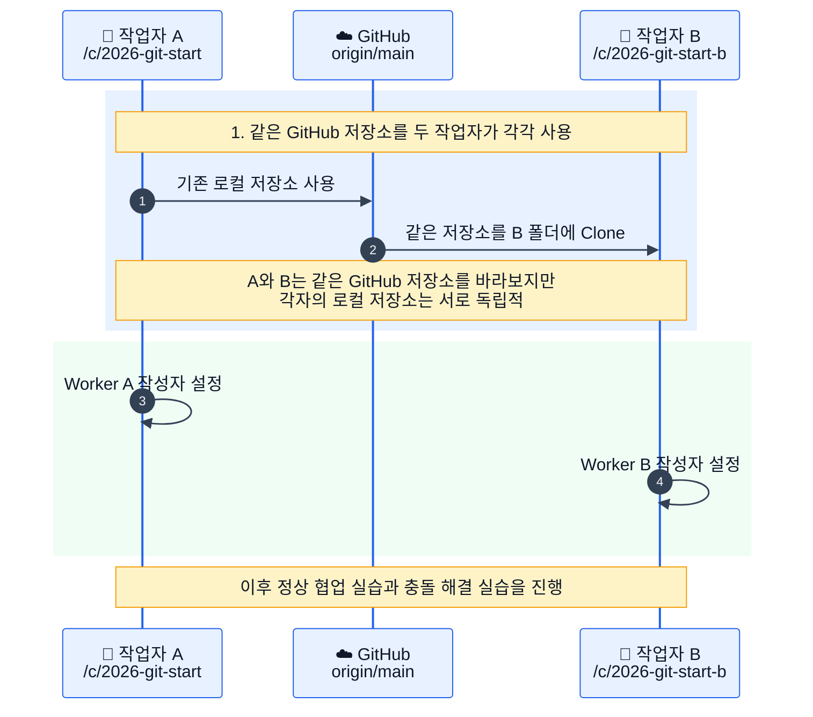
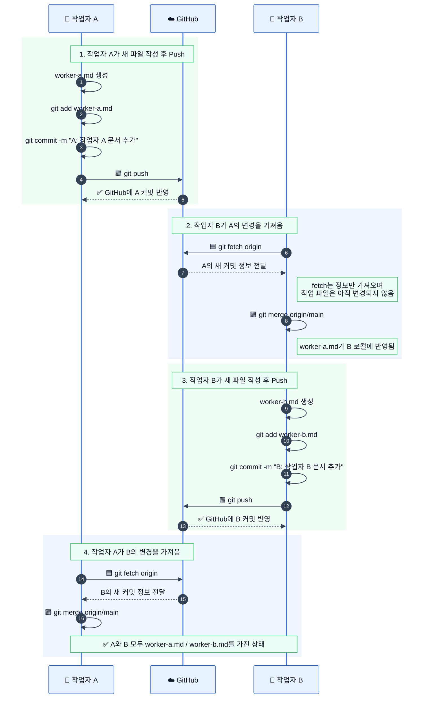
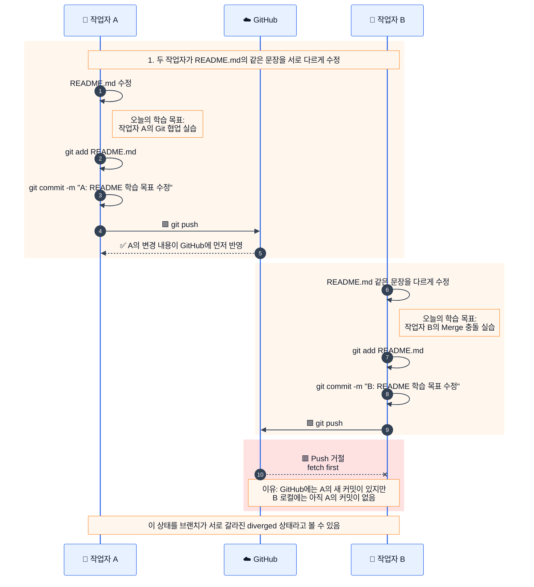
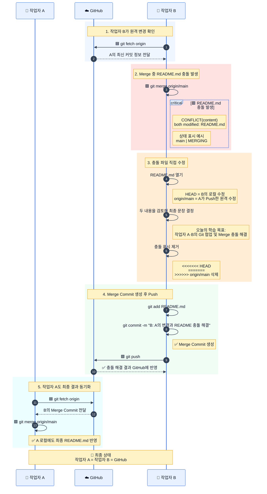

# 2026 Git Start

GitHub에서 README 수정

오늘의 학습 목표: Git 협업과 충돌 해결 실습


# Git 협업 및 충돌 해결 실습 시퀀스 다이어그램

## 1단계. 전체 실습 구조



---

## 2단계. 충돌 없는 협업 흐름



실습 파일에서도 충돌 없는 협업은 작업자 A가 `worker-a.md`를 만들고 Push한 뒤, 작업자 B가 `git fetch origin`과 `git merge origin/main`으로 반영하는 순서로 진행됩니다. 이후 작업자 B가 `worker-b.md`를 Push하고 작업자 A가 다시 가져옵니다.  

---

## 3단계. 같은 README.md 수정과 Push 거절



작업자 B는 A의 변경을 가져오지 않은 상태에서 같은 `README.md` 문장을 수정하고 Push를 시도하므로, GitHub가 `fetch first` 오류로 Push를 거절합니다. 

---

## 4단계. Fetch, Merge, 충돌 해결 및 최종 동기화



작업자 B는 `git fetch origin` 후 `git merge origin/main`을 실행하면서 `README.md` 충돌을 확인합니다. 이후 충돌 표시를 제거하고 최종 문장을 정한 뒤 `git add README.md`, `git commit`, `git push` 순서로 해결합니다. 마지막으로 작업자 A가 다시 `fetch → merge`하여 최종 결과를 동기화합니다.   

---

## 색상 의미

```text
🟦 파랑: fetch, 원격 변경 확인
🟪 보라: merge, 원격 변경을 로컬에 반영
🟩 초록: push, 로컬 커밋을 GitHub에 업로드
🟥 빨강: Push 거절 또는 충돌 발생
🟧 주황: 충돌 파일 직접 수정
🩵 하늘색: 최종 동기화
```
