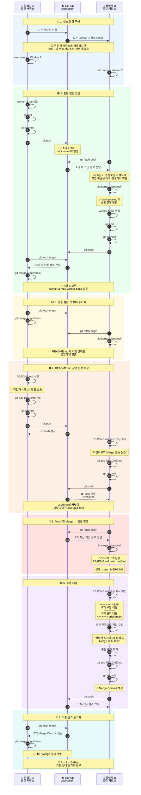

# 2026 Git Start

GitHub에서 README 수정

오늘의 학습 목표: Git 협업과 충돌 해결 실습

```mermaid
sequenceDiagram
    autonumber

    participant A as 👤 작업자 A<br/>로컬 저장소
    participant G as ☁️ GitHub<br/>origin/main
    participant B as 👤 작업자 B<br/>로컬 저장소

    %% =========================
    %% 1. 실습 환경 구성
    %% =========================
    rect rgb(235, 245, 255)
        Note over A,B: 🔵 1. 실습 환경 구성

        A->>G: 기존 저장소 연결
        G->>B: 같은 GitHub 저장소 Clone

        Note over A,B: 같은 원격 저장소를 사용하지만<br/>A와 B의 로컬 저장소는 서로 독립적

        A->>A: user.name = Worker A
        B->>B: user.name = Worker B
    end

    %% =========================
    %% 2. 충돌 없는 협업
    %% =========================
    rect rgb(235, 255, 240)
        Note over A,B: 🟢 2. 충돌 없는 협업

        A->>A: worker-a.md 생성
        A->>A: git add
        A->>A: git commit
        A->>G: git push

        Note over G: ✅ A의 커밋이<br/>origin/main에 반영

        B->>G: git fetch origin
        G-->>B: A의 새 커밋 정보 전달

        Note over B: fetch는 커밋 정보만 가져오며<br/>작업 파일은 바로 변경하지 않음

        B->>B: git merge origin/main

        Note over B: ✅ worker-a.md가<br/>B 로컬에 반영

        B->>B: worker-b.md 생성
        B->>B: git add
        B->>B: git commit
        B->>G: git push

        A->>G: git fetch origin
        G-->>A: B의 새 커밋 정보 전달
        A->>A: git merge origin/main

        Note over A,B: ✅ A와 B 모두<br/>worker-a.md / worker-b.md 보유
    end

    %% =========================
    %% 3. 충돌 실습 준비
    %% =========================
    rect rgb(255, 250, 225)
        Note over A,B: 🟡 3. 충돌 실습 전 상태 동기화

        A->>G: git fetch origin
        A->>A: git merge origin/main

        B->>G: git fetch origin
        B->>B: git merge origin/main

        Note over A,B: README.md와 커밋 상태를<br/>동일하게 맞춤
    end

    %% =========================
    %% 4. 같은 파일 수정
    %% =========================
    rect rgb(255, 240, 230)
        Note over A,B: 🟠 4. README.md 같은 문장 수정

        A->>A: README.md 수정
        Note over A: "작업자 A의 Git 협업 실습"

        A->>A: git add README.md
        A->>A: git commit
        A->>G: git push

        G-->>A: ✅ Push 성공

        B->>B: README.md 같은 문장 수정
        Note over B: "작업자 B의 Merge 충돌 실습"

        B->>B: git add README.md
        B->>B: git commit
        B->>G: git push

        G--xB: ❌ Push 거절<br/>fetch first

        Note over A,B: ⚠️ A와 B의 커밋이<br/>서로 갈라진 diverged 상태
    end

    %% =========================
    %% 5. Fetch / Merge / Conflict
    %% =========================
    rect rgb(255, 225, 225)
        Note over A,B: 🔴 5. Fetch 및 Merge → 충돌 발생

        B->>G: git fetch origin
        G-->>B: A의 최신 커밋 정보 전달

        B->>B: git merge origin/main

        Note over B: ❗ CONFLICT 발생<br/>README.md both modified
        Note over B: 상태: main | MERGING
    end

    %% =========================
    %% 6. 충돌 해결
    %% =========================
    rect rgb(245, 235, 255)
        Note over A,B: 🟣 6. 충돌 해결

        B->>B: README.md 충돌 표시 확인

        Note over B: <<<<<<< HEAD<br/>B의 로컬 내용<br/>=======<br/>A의 원격 내용<br/>>>>>>>> origin/main

        B->>B: 최종 문장으로 직접 수정

        Note over B: "작업자 A·B의 Git 협업 및<br/>Merge 충돌 해결"

        B->>B: 충돌 표시 제거
        B->>B: git add README.md
        B->>B: git commit

        Note over B: ✅ Merge Commit 생성

        B->>G: git push
        G-->>B: ✅ Merge 결과 반영
    end

    %% =========================
    %% 7. 최종 동기화
    %% =========================
    rect rgb(230, 250, 250)
        Note over A,B: 🩵 7. 최종 결과 동기화

        A->>G: git fetch origin
        G-->>A: B의 Merge Commit 전달

        A->>A: git merge origin/main

        Note over A,G: ✅ 최신 Merge 결과 반영
        Note over A,B: 🎉 A = B = GitHub<br/>최종 상태 동기화 완료
    end
```
